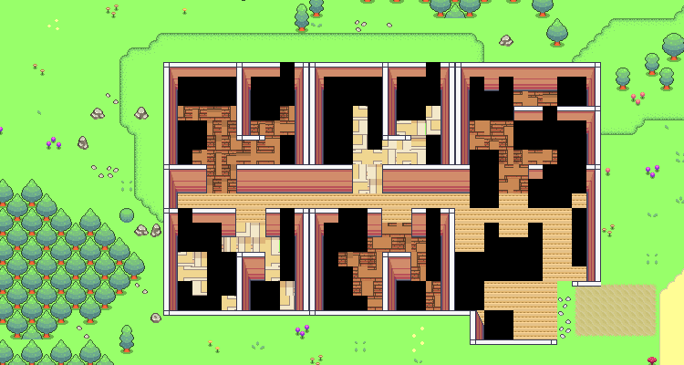

## Experimental Plan

- [x] Read the original paper to get an overview of how simulation works
- [x] Check the source code to find out how to modify the simulation & change the OpenAI
      API.
  - After skimming the source code and checking several repository's forks, I have an idea
    of how to change the code:
  - Use open-source model: this would be easy since there are just several functions that
    need to be modified. + Romantic simulation: there are several prompt templates. The
    initial idea is to modify agents' profile and simulation contexts (i.e., a dating
    show).

## Logs

- The source code is quite messy, it took some time to reformat it.
- I updated the code to local LLM for fast iteration. I checked different libraries:
  [`llm`](https://llm.datasette.io/en/stable/), `ollama` and `gpt4all`. I decided to use
  `llm` library since it has plugins to use models from other libraries like `llm-ollama`
  and `llm-gpt4all`. Its Python API and CLI also very convenient for me to experiment
  with.
- The original simulation used `gpt-3.5-turbo` model. The prompt template showed that the
  model is used for text generation/completion instead of forming chat dialog. Thus, I
  think the pre-trained/Instruct models would be suitable for the simulation. In fact, I
  did try nearly all of the models supported by `llm-gpt4all` and `llm-ollama` using the
  following prompt:

  ```
  Output the best keyword that describes an action.

  Action: "Dolores is making breakfast"
  Keyword: "Cooking"
  ---
  Action: "Joey is off to see a baseball game"
  Keyword: "Watching"
  ---
  Action: "driving to work"
  Keyword: "Commuting"
  ---
  Action: "driving to a friends house"
  Keyword: "'
  ```

  **Expected result:** `Visiting`

  The cheap/small models failed to return an answer. The large enough model which is
  heavily fine-tuned on chat/dialog data failed to give a concise answer for the prompt.
  The final model I decided to use is `meta-llama/llama-3.1-70b-instruct` since it
  returned the expected answer.

- I modified the code to use local/OpenRouter's API depending on environment variables set
  in `.env` file.
- I created a new simulation, namely `loveville` with only 3 agents. The agents' profiles
  and several prompt templates (i.e `decide_to_react`, `decide_to_talk`) were modified.
  However, the simulation keeps throwing exceptions about empty responses (the model
  failed to generate a text to the prompt, so the content of the response is empty).
- I found a way to run the simulation manually simply by copying the prompt generated by
  the simulation and running it myself. The prompt related to the agent's interaction
  always returns an empty response, which I don't know why and haven't found a solution
  yet.

## Improvements



- There are bugs in the front-end that I haven't had time to look at: agents not moving,
  some blocks are just black, etc. Since it does not affect the simulation itself, I
  didn't fix them yet.
- Keep experimenting and working on the prompt templates to improve the agents'
  interaction and allow them to form a romantic relationship.
